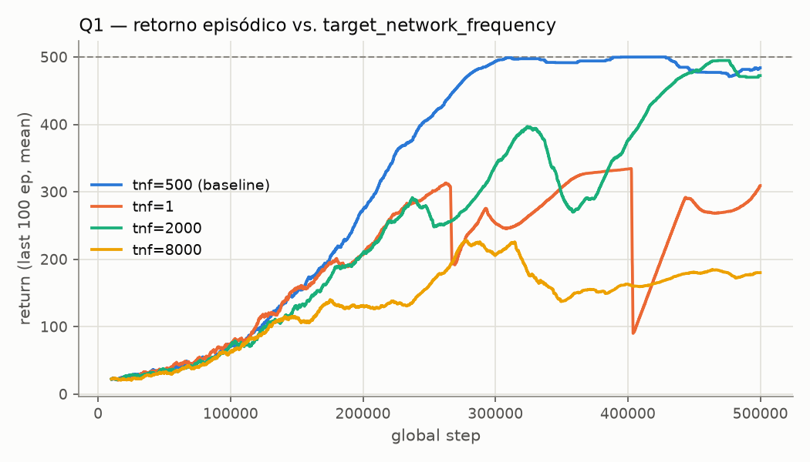
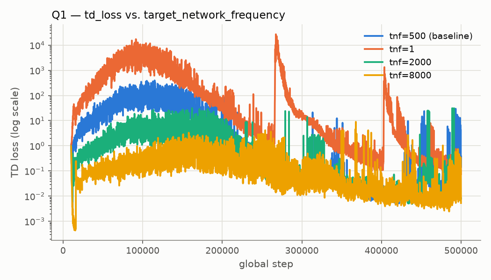
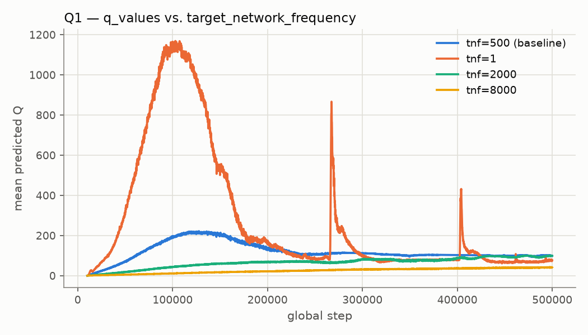
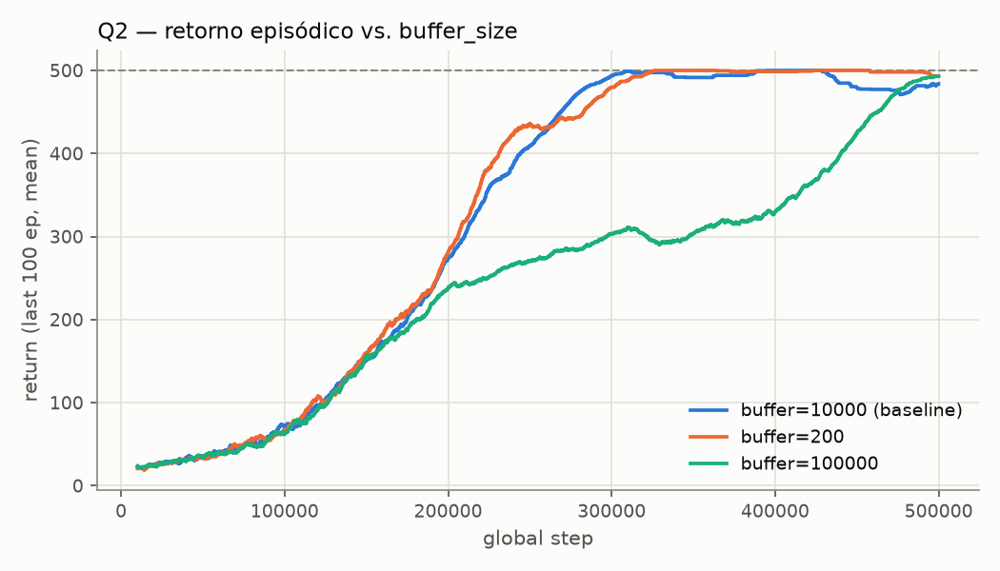
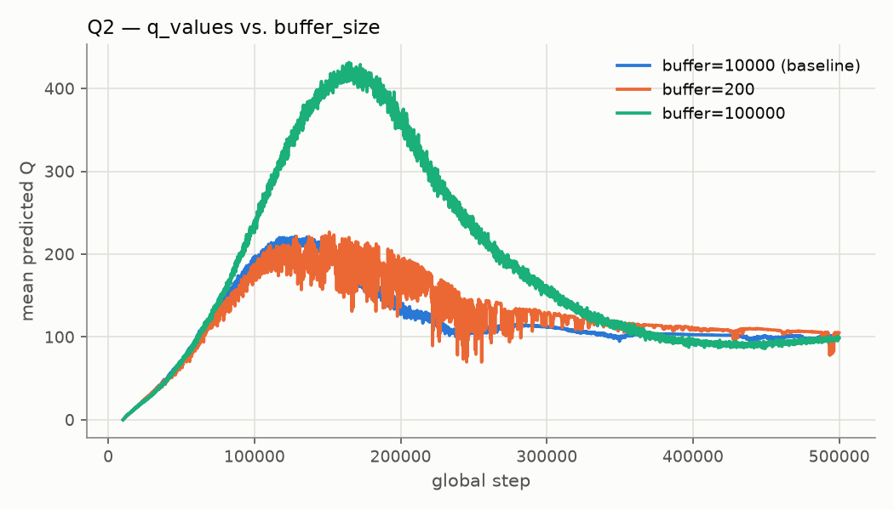
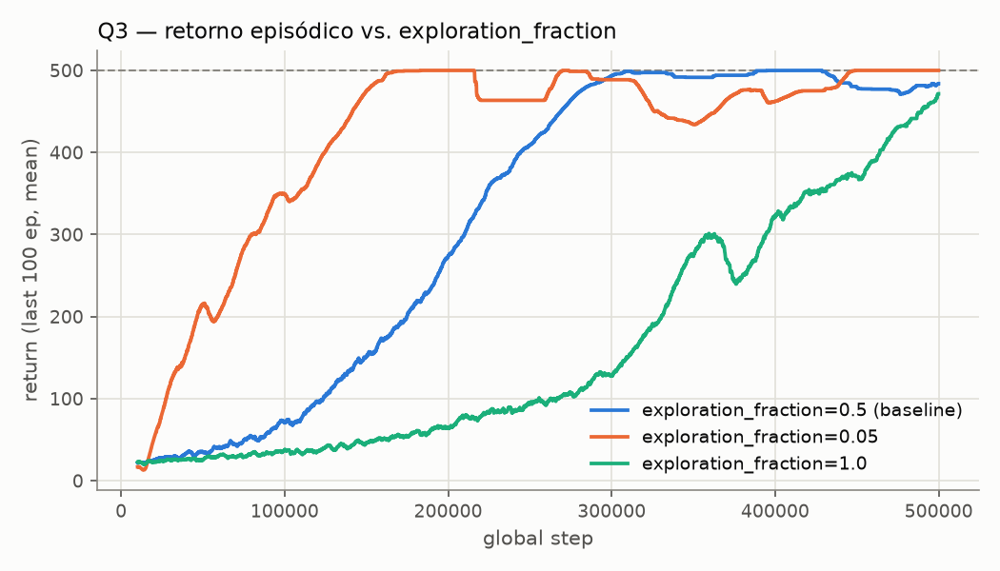
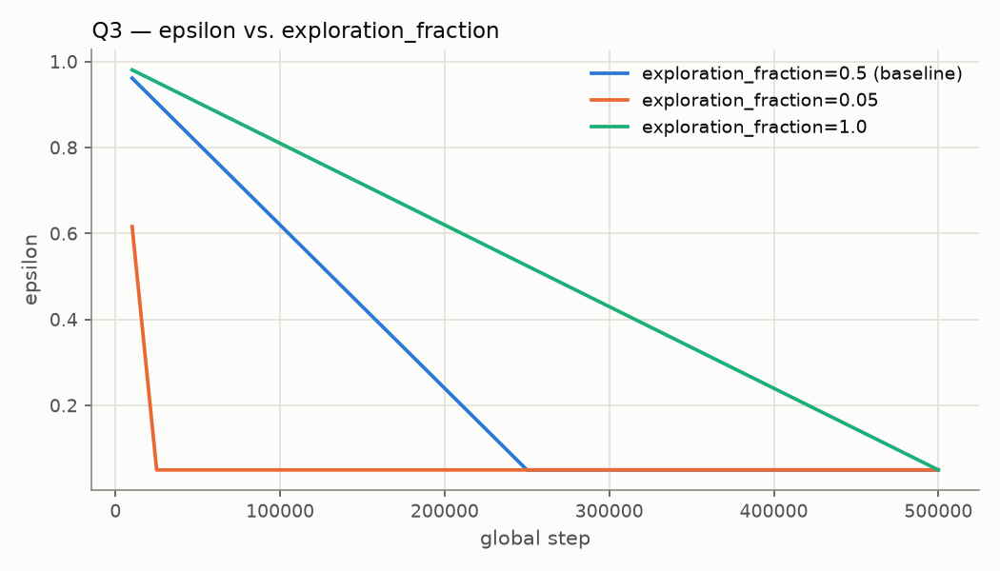
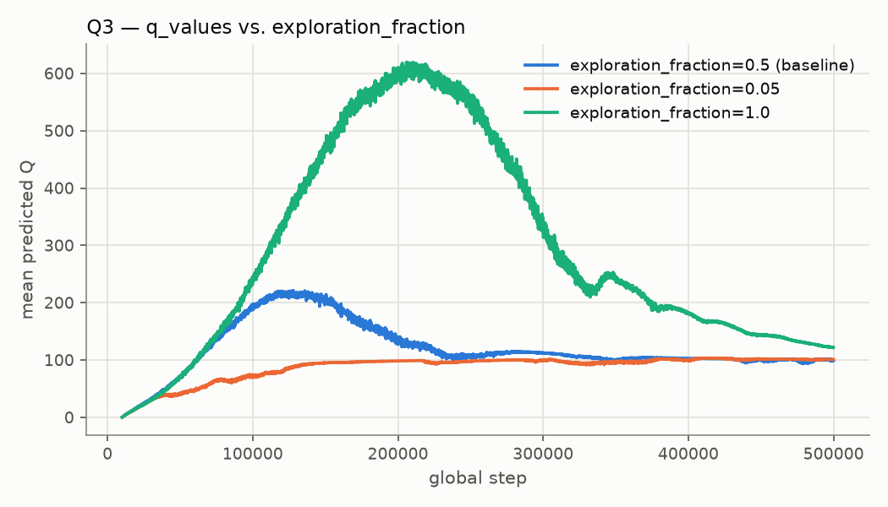

# Relatório — Deep Q-Networks (DQN) no CartPole-v1

**Autor:** Lucas Ozorio (individual)
**Fork com `algorithms/dqn.py` completo:** https://github.com/lucas-ozorio/t-zero-learning
**Projeto W&B:** https://wandb.ai/ozorio-federal-university-of-goi-s/dqn-assignment

Todos os runs usam `total_timesteps=500000`, config base `dqn_cartpole.yml`. Cada
configuração foi rodada com 2 seeds (`seed=1`, `seed=2`); os gráficos mostram a
média das duas seeds por configuração. Retorno máximo do CartPole-v1: 500.

| Config | eval/mean_return (seed 1 / seed 2) |
|---|---|
| baseline (defaults) | 500.0 / 500.0 |
| Q1 tnf=1 | 354.2 / 441.1 |
| Q1 tnf=2000 | 500.0 / 500.0 |
| Q1 tnf=8000 | 189.7 / 189.2 |
| Q2 buffer=200 | 500.0 / 500.0 |
| Q2 buffer=100000 | 500.0 / 500.0 |
| Q3 exploration_fraction=0.05 | 500.0 / 500.0 |
| Q3 exploration_fraction=1.0 | 500.0 / 500.0 |

---

## Q1 — Frequência de sincronização da target network

**Hiperparâmetro:** `dqn.target_network_frequency` (baseline = 500)
**Varredura:** 1 (sincroniza a cada passo — com `tau=1.0` isso equivale a não
ter target network separada), 2000, 8000 (alvo quase congelado)

### Previsão

A target network existe para quebrar o acoplamento entre os valores que a
rede está aprendendo e o alvo de TD que ela persegue — sem isso, `Q(s,a)` e
`max_a' Q(s',a')` mudam juntos a cada gradiente, criando um alvo em
movimento que pode realimentar a si mesmo. Esperávamos que
`target_network_frequency=1` produzisse `losses/q_values` instável ou com
crescimento descontrolado, e que `charts/episodic_return_mean_last100`
ficasse ruidosa ou não atingisse 500. Com `target_network_frequency=8000`
esperávamos um alvo estável (`td_loss` "bem-comportado"), mas aprendizado
mais lento por o alvo estar desatualizado.

### Gráficos

{width=48%} {width=48%}

{width=48%}

### Explicação

**A previsão se confirmou, nos dois extremos, mas por mecanismos distintos em
cada ponta.** Com `tnf=1`, `losses/q_values` dispara para ~1150 (contra um Q
ótimo teórico de ~100, já que com `gamma=0.99` e episódios de até 500 passos
o retorno descontado satura perto de `1/(1-0.99)≈100`) e o retorno cai
abruptamente por volta dos steps 270k e 400k — exatamente onde `td_loss`
também explode (picos de ~27.000, ordens de grandeza acima do baseline). O
mecanismo é o clássico problema do "alvo em movimento": como a target
network é copiada da rede online a cada passo, o alvo de TD passa a depender
diretamente dos mesmos pesos que estão sendo atualizados, então um pequeno
aumento em `Q(s,a)` empurra o próprio alvo para cima no próximo passo,
criando um ciclo de retroalimentação positiva (overestimation bootstrapping)
que diverge até a política colapsar — visível como as quedas abruptas no
retorno, seguidas de recuperação parcial quando a rede volta a se
estabilizar.

Já com `tnf=8000`, a curva de retorno degrada de forma completamente
diferente: ela nunca decola (estaciona em ~180-200) e ao mesmo tempo
`losses/q_values` cresce muito lentamente (fica bem abaixo do baseline o
tempo todo) e `td_loss` (em escala log) é a **mais baixa entre todas as
configurações** durante praticamente todo o treino. Isso responde
diretamente à pergunta do enunciado: o `td_loss` mede o quão bem `Q(s,a)`
se ajusta ao alvo *atual*, não o quão bom o alvo é. Com o alvo quase
congelado, a rede converge rapidamente para prever um alvo desatualizado e
"fácil" — a perda fica baixa porque o problema de regressão ficou trivial,
não porque a política aprendida é boa. Enquanto isso o alvo em si segue
essencialmente parado (baseado em pesos de milhares de passos atrás), então
a política nunca recebe sinal suficiente para melhorar antes do próximo
sync. Isso ilustra bem por que target network e velocidade de sincronização
são um trade-off de viés-variância: rápido demais reintroduz o alvo móvel
que a target network deveria evitar; devagar demais transforma o alvo em
uma meta obsoleta que a política persegue sem nunca alcançar algo útil.

---

## Q2 — Tamanho do replay buffer

**Hiperparâmetro:** `dqn.buffer_size` (baseline = 10000)
**Varredura:** 200 (minúsculo, menor que `learning_starts=10000`), 100000
(10x o baseline)

### Previsão

Esperávamos que um buffer minúsculo (200) causasse dois problemas
distintos: (1) as amostras de um minibatch viriam de uma janela muito
estreita e recente da trajetória, violando a premissa de amostras i.i.d.
que o treinamento por TD assume; (2) a rede só poderia "rever" uma fração
muito pequena da experiência passada, esquecendo rapidamente estados vistos
antes. Esperávamos por isso `charts/episodic_return_mean_last100` mais
instável e `losses/q_values` mais ruidoso com buffer=200, e uma curva mais
suave com buffer=100000.

### Gráficos

{width=48%} {width=48%}

### Explicação

**A previsão não se confirmou como esperado — na verdade o oposto
aconteceu.** `buffer=200` converge tão rápido quanto o baseline (levemente
mais rápido, entre steps 200k-300k) e sem instabilidade visível em
`losses/q_values` (a curva segue quase colada ao baseline). Já
`buffer=100000` é a configuração mais lenta a convergir (só se aproxima de
500 perto do fim do treino) e mostra o maior *overshoot* de
`losses/q_values` entre as três (pico de ~420, o dobro do baseline).

O motivo é o segundo problema citado na dica do enunciado — "quais dados a
rede consegue rever" — mas na direção contrária à que previmos: no
CartPole, o comportamento ótimo é essencialmente um único "modo" (balançar
o poste), então a correlação temporal dentro de um minibatch de 200
transições recentes não prejudica muito, pois essas transições já cobrem
bem o espaço de estados relevante naquele estágio do treino — o problema
teórico de correlação existe, mas esse ambiente é simples e estacionário
demais para expô-lo. O buffer de 100000, por outro lado, retém por muito
mais tempo transições antigas coletadas quando a política ainda era quase
aleatória (epsilon alto, início do treino): como a amostragem é uniforme
sobre todo o buffer, uma fração grande dos minibatches por muito tempo
ainda inclui essas transições de baixa qualidade, diluindo o sinal das
transições recentes e mais informativas — isso explica tanto a convergência
mais lenta quanto a maior superestimação transiente de Q (a rede
"aprende demais" com dados desatualizados antes que eles sejam
suficientemente substituídos por experiência mais recente). Em suma: buffer
pequeno demais pode causar os dois problemas previstos em ambientes não
estacionários ou com múltiplos modos de comportamento, mas aqui o efeito
dominante observado foi o inverso — buffer grande demais atrasando o
esquecimento de dados obsoletos.

---

## Q3 (EXTRA) — Fração de exploração

**Hiperparâmetro:** `dqn.exploration_fraction` (baseline = 0.5)
**Varredura:** 0.05 (decaimento muito rápido de epsilon), 1.0 (decaimento ao
longo de todo o treino)

**Gráficos escolhidos e por quê:** `charts/episodic_return_mean_last100`
(efeito final no desempenho), `charts/epsilon` (obrigatório — sem ele não dá
para confirmar *se* o cronograma de exploração realmente mudou como
configurado, só inferir pelo efeito indireto), e `losses/q_values` (para
checar se menos/mais exploração muda o regime de superestimação, já que
mais ruído nas ações injeta mais variância nas transições usadas como
bootstrap).

### Previsão

Com `exploration_fraction=0.05`, epsilon cai até `end_e` quase no início do
treino — esperávamos risco de convergência prematura para uma política
subótima, já que o agente vira quase totalmente guloso antes de a rede Q
ter estimativas confiáveis. Com `exploration_fraction=1.0`, epsilon decai
lentamente por todo o treino — esperávamos aprendizado mais lento a
aparecer, já que ação aleatória "atrapalha" mesmo com boas estimativas de Q
mais tarde no treino.

### Gráficos

{width=48%} {width=48%}

{width=48%}

### Explicação

`charts/epsilon` confirma que os cronogramas saíram como configurados:
`exploration_fraction=0.05` derruba epsilon para `end_e=0.05` por volta do
step 25k, enquanto `exploration_fraction=1.0` decai linearmente até o fim
do treino.

**A metade da previsão para `exploration_fraction=1.0` se confirmou:** essa
configuração é visivelmente a mais lenta a aprender (só ultrapassa 400 de
retorno perto de 450k steps) e tem o maior *overshoot* de `losses/q_values`
(pico de ~620, o triplo do baseline) — mais ruído nas ações ao longo de
praticamente todo o treino gera transições mais variadas/menos
correlacionadas com a política gulosa atual, então o alvo de bootstrap fica
mais difícil de ajustar, inflando temporariamente as estimativas de Q antes
de estabilizar quando epsilon finalmente cai no fim.

**Já a previsão para `exploration_fraction=0.05` não se confirmou** — ao
invés de convergência prematura para algo subótimo, essa configuração
aprendeu **mais rápido** que o baseline (atinge quase 500 já por volta dos
170k steps) e com a curva de `q_values` mais suave e monotônica de todas
(quase sem *overshoot*, subindo direto para ~100). A razão é que
`learning_starts=10000` já garante uma fase inicial de coleta
(quase)aleatória antes de qualquer atualização de gradiente, então o risco
de "explorar pouco" some rapidamente: assim que epsilon cai, o agente passa
a agir de forma quase gulosa sobre uma rede que já está sendo atualizada a
cada poucos passos, e como o CartPole tem recompensa densa (+1 por passo) e
um único comportamento ótimo bem definido (sem armadilhas ou mínimos locais
enganosos), reduzir o ruído de ações cedo simplesmente acelera a
convergência ao invés de prejudicá-la. O risco teórico de convergência
prematura que motivou a previsão é real, mas se manifestaria mais em
ambientes com recompensa esparsa ou múltiplos modos de comportamento
competindo — não neste.
